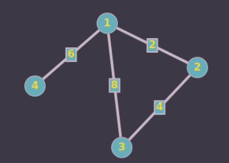
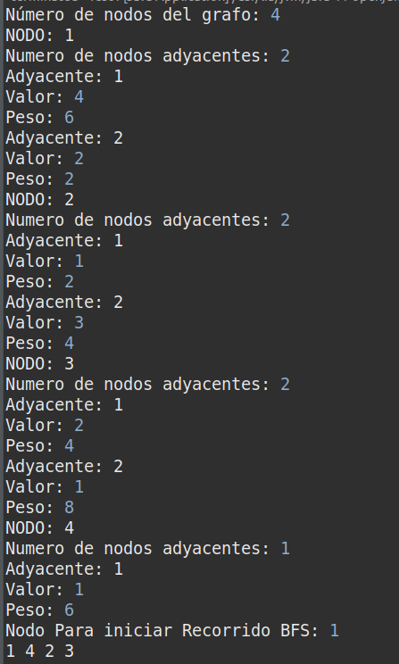
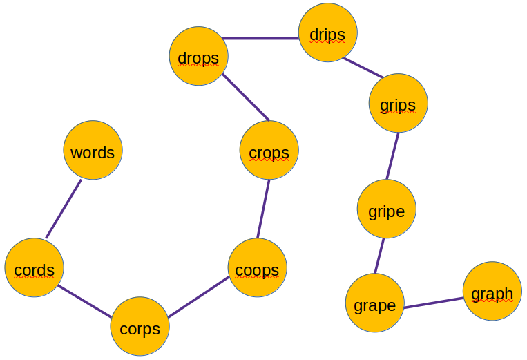
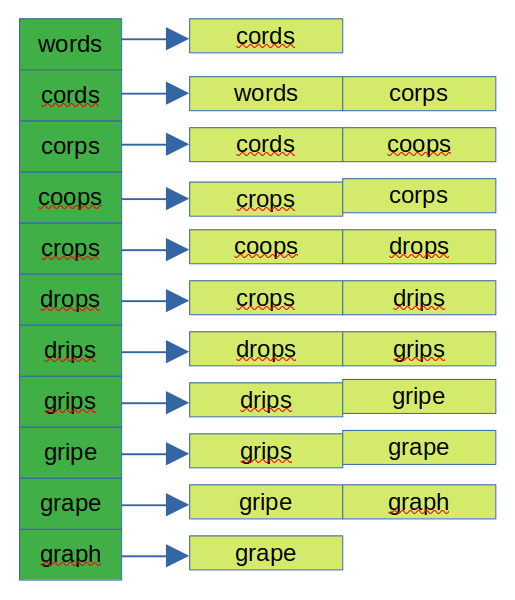

<div align="center">
<table>
    <theader>
        <tr>
            <td></td>
            <th>
                <span style="font-weight:bold;">UNIVERSIDAD NACIONAL DE SAN AGUSTIN</span><br />
                <span style="font-weight:bold;">FACULTAD DE INGENIERÍA DE PRODUCCIÓN Y SERVICIOS</span><br />
                <span style="font-weight:bold;">ESCUELA PROFESIONAL DE INGENIERÍA DE SISTEMAS</span>
            </th>
            <td></td>
        </tr>
    </theader>
    <tbody>
        <tr><td colspan="3"><span style="font-weight:bold;">Formato</span>: Guía de Práctica de Laboratorio / Talleres / Centros de Simulación</td></tr>
        <tr><td><span style="font-weight:bold;">Aprobación</span>:  2022/03/01</td><td><span style="font-weight:bold;">Código</span>: GUIA-PRLD-001</td><td><span style="font-weight:bold;">Página</span>: 1</td></tr>
    </tbody>
</table>
</div>

<div align="center">
<span style="font-weight:bold;">INFORME DE LABORATORIO</span><br />
<span>(formato estudiante)</span>
</div>


<table>
<theader>
<tr><th colspan="6">INFORMACIÓN BÁSICA</th></tr>
</theader>
<tbody>
<tr><td>ASIGNATURA:</td><td colspan="5">Estructuras de Datos y Algoritmos</td></tr>
<tr><td>TÍTULO DE LA PRÁCTICA:</td><td colspan="5">Grafos</td></tr>
<tr>
<td>NÚMERO DE PRÁCTICA:</td><td>08</td><td>AÑO LECTIVO:</td><td>2022 A</td><td>NRO. SEMESTRE:</td><td>III</td>
</tr>
<tr>
<td>FECHA DE PRESENTACIÓN:</td><td colspan="2">21-Ago-2022</td><td>HORA DE PRESENTACIÓN:</td><td colspan="2">23:55</td>
</tr>
<tr><td colspan="4">INTEGRANTE (s):
<ul>
<li>Moroccoire/Pacompia, Anthony Marcos - amoroccoire@unsa.edu.pe</li>
</ul>
</td>
<td>NOTA:</td><td>Pendiente</td>
</tr>
<tr><td colspan="6">DOCENTES:
<ul>
<li>Richart Smith Escobedo Quispe (rescobedoq@unsa.edu.pe)</li>
</ul>
</td>
</tr>
</tbody>
</table>

<!-- Reportes -->

## SOLUCIÓN Y RESULTADOS

---

I. SOLUCIÓN DE EJERCICIOS/PROBLEMAS <br>


* La clase [NodoGrafo.java](ImplementacionGrafo/NodoGrafo.java "NodoGrafo.java") tiene los atributos: padre (Nodo de tipo grafo), estado (booleano), lista(Lista enlazada)

    ```
    private NodoGrafo<T, N> padre;
	private boolean estado;
	private Lista<T, N> lista;
	
	public NodoGrafo() {
		estado = false;
		lista = new Lista<T, N>();
		padre = null;
	}
    ```
    Asimismo contiene metodos, entre los cuales se encuentra el método "marcar()" y "desmarcar()", que funcionan para cambiar el estado del nodo cuando es visitado o necesita ser reiniciado.

    Se ha creado manualmente la lista enlazada, cada uno de sus nodos almacena dos valores, el primero representa el número del nodo y el segundo valor el peso de su arista a uno de los nodos adyacentes

    ```
    private T dato;
    private U peso;
    private Node<T, U> nextNode;
  
    public Node(T e, U y) {
    	dato = e;
    	peso = y;
    }
    ```
    Los otros métodos del nodo se mantienen igual con ligeras variaciones, al igual que los métodos de la clase Lista.
    Para conseguir la representación del grafo, se ha usado un arreglo simple de Nodos de tipo grafo, cuyo tamaño es determinado en el constructor de la clase [Grafo.java](ImplementacionGrafo/Grafo.java "Grafo.java"), el metodo es el siguiente:
    ```
    public void add(T valor, N peso, int indice) {
		if (nodos[indice] == null)
			nodos[indice] = new NodoGrafo<T, N>();
		nodos[indice].agregarAdyacente(valor, peso);
	}
    ```
    Recibe los paramteros valor; que representa el contenido del nodo, peso; representa el peso de la arista del nodo adyacente e indice que ayuda a ubicar al nodo en el array, en los test, el parametro valor sera igual al indice.

* Algoritmo BFS
    Para elaborar el algoritmo se ha traducido el pesudocodigo del documento presentado por el docente. Este método recibe como parametro un indice para saber con que nodo empezar primero.
    ```
		for (int i = 0; i < nodos.length; i++)
			distancia[i] = -1;
	```
    En esta seccion del codigo se inicializa al arreglo de distancias con valor -1

    ```
		nodos[valor].marcar();
		orden += (valor + 1) + " ";
		distancia[valor] = 0;
    ```
    En la primera linea se marca al indice del nodo pasado como parametro como true, luego se concatena a un String para hacer un registro de los nodos visitados y luego retornarlo, luego en un arreglo de int[] "distancia" con tamaño igual al del grafo se cambia la distancia a 0.

    Mas adelante se inica una cola y se añade el indice pasado como parametro, luego mientras la cola no este vacia se obtendra la lista enlazada asociado al indice para luego hacer un recorrido que marcaracomo visitado o no al nodo adyacente.

    Para probar el metodo BFS se creo el siguiente grafo:
    

    Ejecute la clase [Test1.java](ImplementacionGrafo/Test1.java) e ingrese el grafo via comando, la soguiente captura es la prueba con el mismo grafo presentado anteriormente

    

    Como resultado en la última linea se ve el orden: 1 4 2 3

    No se ha conseguido implementar existosamente el algoritmo DFS y Dijkstra, por ello no se ecuentra en los archivos.
    
* Solución del ejercicio del Grafo de Palabras
    * Dibuje el grafo definido por las siguientes palabras: words, cords, corps, coops, crops, drops, drips, grips, gripe, grape, graph

    

    * Mostrar la lista de adyacencia del grafo

    

II. SOLUCIÓN DEL CUESTIONARIO

* ¿Cuantas variantes del algoritmo de Dijkstra hay y cuál es la diferencia entre ellas?
    
    Existen muchas variantes del algoritmo, la versión original encontraba la ruta más corta entre dos nodos, pero una variante más común: fija un solo nodo como el nodo "fuente" y encuentra las rutas más cortas desde la fuente a todos los demás nodos.

    Tambien se usa ampliamente en los protocolos de enrutamiento de red, más en IS-IS (Intermediate System to Intermediate System) y Open Shortest Path First (OSPF). 
  
* Invetigue sobre los ALGORITMOS DE CAMINOS MINIMOS e indique, ¿Qué similitudes encuentra, qué diferencias, en qué casos utilizar y porque?

   Las similitudes son: encontrar caminos entre 2 nodos de manera que el costo de los nodos que lo consituyen sea el mínimo posible, esto signofica que permiten estudiar distancias, tiempos de tranporte, etc. En su implementación es posible representarlo con matrices de adyacencia.

   La diferencia esta los métodos que usan, por ejemplo el Algoritmo de Busqueda A* usa la heurística para agilizar la busqueda, otros algoritmos son mejores en grafos con muchos nodos, y también depende del enfoque al que se inclinan, por ejemplo el Algoritmo de Viterbi resuelve el problema del camino estocástico más corto con un peso probabilístico adicional en cada nodo.

---

III. CONCLUSIONES

* Los algoritmos para recorrer un grafo pueden llegar a ser complejos en su comprension e implementación

* Es notorio que muchos de los algoritmos de recorridos minimos son usado ampliamente en distintos campos de la ciencia y esta presente en nuestras visas

---
    
## RETROALIMENTACIÓN GENERAL
 <pre>
 
 </pre>
---
    
### REFERENCIAS Y BIBLIOGRAFÍA
<ul>
    <li>Escuela de Pedagogía en Educación Matemática, Marcelino Álvarez, et.al.,
http://repobib.ubiobio.cl/jspui/bitstream/123456789/1953/3/Alvarez_Nunez_Marcelino.pdf</li>
    <li>http://www.oia.unsam.edu.ar/wp-content/uploads/2017/11/dijkstra-prim.pdf</li>
</ul>
